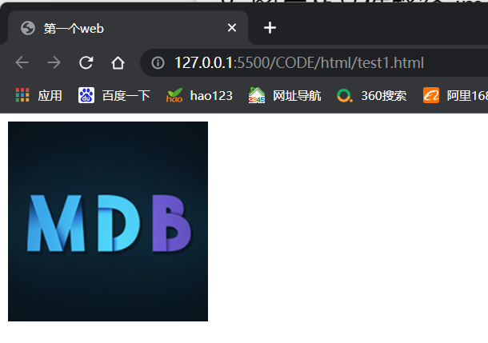

#前言
  随着网络技术和社会科技的不断发展，前端技术目前已经和后端技术同样受到大众的关注，占据同等重要的位置。要学习web技术，众所周知的就是所谓的前端三剑客：“HTML”、“CSS”、“JavaScript”，这三部分对于我而言同等重要。这学期跟着老师学习了Web应用基础这门课程，HTML和CSS是Web开发的必备基础技术，HTML用于构建网页的结构和内容，而CSS用于样式和布局。在此对学习的HTML以及CSS内容做一个总结回顾。
##一、HTML
   所谓HTML是超文本标记语言（HyperText Markup Language）的缩写，是为“网页创建和其它可在网页浏览器中看到的信息”设计的一种标记语言。我常用的标签有 body、head、title、p、img、a、div、s。此处需要注意HTML并不是一门语言，而是一种用于定义内容结构的标记语言。现在基本上都用heml5，最新的HTML5同时引入了一些有效率、表达明确的标签。

####1.html的文档结构与运行
   - 首先我们要做的就是创建自己的文件，运行VScode后打开你的目标文件夹，在其中新建文件，只要输入后缀为.html，就会成功创建一个html文件了。若初始新建的html文件为空我们可以输入“!”后直接按tab键就可以直接生成标准的HTML文件格式：

```html
    <!DOCTYPE html>
<html lang="en">
<head>
    <meta charset="UTF-8">
    <meta http-equiv="X-UA-Compatible" content="IE=edge">
    <meta name="viewport" content="width=device-width, initial-scale=1.0">
    <title>Document</title>
</head>
<body>
    
</body>
</html>
```
  - 可以注意到HTML文件中代码都被<html lang='en'>和</html>包裹着，而中间又分为两大块<head>以及<body>，分别代表着头部设置和页面主体。下面我们可以试着书写自己的第一个HTML文件，比如我的第一个html文件：

```
<!DOCTYPE html>
<html lang="en">
<head>
    <meta charset="UTF-8">
    <meta http-equiv="X-UA-Compatible" content="IE=edge">
    <meta name="viewport" content="width=device-width, initial-scale=1.0">
    <title>第一个web</title> <!-- 页面的名称 -->
</head>
<body> <!-- 页面的内容 -->
    我的第一个web页
</body>
</html>
```
- 这样就非常简单的完成了自己的第一个HTML文件的书写。接下来我们可以在VScode中加载插件Live Server，这是个非常方便的插件，只要下载后在html文件页面点击右下方出现的Open with Live Server用LiveServer打开字样就会自动在你的浏览器中跳出当前html文件所对应的页面，你对html做出的任何更改都可以实时展示在页面上，非常地方便。我的第一个网页运行效果为：
 
<center>
    
</center></br>
  
  - 可以看到我们写在<body>中输入的内容确实展示在了浏览器的页面当中。HTML文档结构分析如下:
  
  ```
  <!DOCTYPE html>: 声明文档类型，现今可有可无。
<html></html>: <html>元素。这个元素包裹了整个完整的页面，是一个根元素，其它元素都嵌套到其中。
<head></head>: <head>元素。 这个元素是一个容器，它包含了所有你想包含在HTML页面中但不想在HTML页面中显示的内容。这些内容包括你想在搜索结果中出现的关键字和页面描述，CSS样式，字符集声明等等。
<meta charset="utf-8">: 这个元素设置文档使用utf-8字符集编码。
<title></title>: 设置页面标题，出现在浏览器标签上，当你标记/收藏页面时它可用来描述页面。
<body></body>: <body>元素。 包含你能在页面看到的所有内容，包括文本，图片，音频，视频等等。
  ```

####2.各种HTML元素
  - 标题元素</br>
    HTML 提供了从大到小6级标题,为`<h1>~<h6>` ，文本格式如下所示：
 ```
    <h1>一级标题</h1>
    <h2>二级标题</h2>
    <h3>三级标题</h3>
    <h4>四级标题</h4>
    <h5>五级标题</h5>
    <h6>六级标题</h6>
 ```   
   &nbsp;&nbsp;&nbsp;&nbsp;&nbsp;&nbsp;&nbsp;&nbsp;效果为：</br>
<center>
    
</center></br>
  
  - 文本格式</br>
    常见的文本格式有：
```
    <p>你可以<mark>标亮</mark>字体。</p>
    <p><del>你可以划去改行</del></p>
    <p><ins>你可以将改行设置下划线</ins></p>
    <p><small>你可以设置字体变小</small></p>
    <p><strong>你可以加粗改行</strong></p>
    <p><em>你可以设置字体为斜体</em></p>
```
&nbsp;&nbsp;&nbsp;&nbsp;&nbsp;&nbsp;&nbsp;&nbsp;效果为
<center>
    
</center></br>

- 超链接</br>
   现今超链接在我们生活中时刻被使用，使用超链接可以访问其他网站，例如
```
<a href="https://www.baidu.com/" target="_blank"></a>
```
&nbsp;&nbsp;&nbsp;&nbsp;&nbsp;&nbsp;&nbsp;&nbsp;该效果会显示一张图片，点击该图片会跳转到百度官网，效果截图为：
<center>
    
</center></br>

- 图片及文件路径</br>
  
&nbsp;&nbsp;&nbsp;&nbsp;&nbsp;&nbsp;&nbsp;&nbsp;想要插入一张图片，则需要知道图片所在位置，例如：
```
   
```
&nbsp;&nbsp;&nbsp;&nbsp;&nbsp;&nbsp;&nbsp;&nbsp;效果截图为：
<center>
    
</center></br>

&nbsp;&nbsp;&nbsp;&nbsp;&nbsp;&nbsp;&nbsp;&nbsp;注意：src属性为要显示图片文件的位置，即图片文件路径

- 表格</br>
表格在日常生活中也常常被用到，使使用者能够很方便的看到所显示的结果，案例如下，显示一个最简单的表格：
```
    <table>
        <tr>
          <th>学号</th>
          <th>姓名</th>
          <th>体重</th>
        </tr>
        <tr>
          <td>001</td>
          <td>王五</td>
          <td>45kg</td>
        </tr>
        <tr>
          <td>002</td>
          <td>张三</td>
          <td>58kg</td>
        </tr>
      </table>
```
&nbsp;&nbsp;&nbsp;&nbsp;&nbsp;&nbsp;&nbsp;&nbsp;在该代码中，`<tr>`表示行, `<td>`表示行中的单元, `<th>`是表头的单元（默认将会加粗显示）效果图如下：
<center>
    
</center></br>

- 列表</br>
我们可以使用列表来呈现我们想要展示的内容，有无序列表和有序列表，案例如下。
```
<ul>
  <li>h</li>
  <li>x</li>
  <li>j</li>
</ul>
<!--表示出来为小黑圆圈-->
<ol>
  <li>h</li>
  <li>x</li>
  <li>j</li>
</ol>

```
&nbsp;&nbsp;&nbsp;&nbsp;&nbsp;&nbsp;&nbsp;&nbsp;效果图如下：
<center>
    
</center></br>

-  表单</br>
   当网站需要获取我们的一些信息如：用户名、密码、性别等信息时，我们就需要使用表单（form）来让用户填写或选择。HTML依靠`<input>`标签向后台输入数据。
```
<input>标签常用属性为：
text    定义单行输入字段，默认宽度为 20 个字符
password    定义密码字段，该字段字符被掩码
radio    定义单选按钮
checkbox    定义复选框
button    定义可点击按钮（一般通过 Javascript 启动脚本）
hidden    定义隐藏的输入字段
image    定义图像形式的提交按钮
file    定义输入字段和“浏览”按钮，供文件上传
reset    定义重置按钮，清楚表单中所有数据
submit    定义提交按钮，把表单数据发送到服务器
```

&nbsp;&nbsp;&nbsp;&nbsp;&nbsp;&nbsp;&nbsp;&nbsp;一个简单的表单案例如下
```
<div>
<form>
  <!-- 文本框，注意有 placeholder 提示符 -->
  用户名：<br>
  <input type="text" name="name" placeholder="请输入用户名" required><br>
  <!-- 密码框 -->
  密码：<br>
  <input type="password" name="ps" placeholder="请输入密码" required><br>
  年龄：<br>
  <!-- 数字输入框，注意 min 和 value 属性-->
  <input type="number" name="age" min="18" value="18"><br>
  <!-- 单选按钮, 注意 checked 属性 -->
  性别：<br>
  <input type="radio" name="gender" value="male" checked> 男<br>
  <input type="radio" name="gender" value="female"> 女<br>
</form>

```
&nbsp;&nbsp;&nbsp;&nbsp;&nbsp;&nbsp;&nbsp;&nbsp;效果图如下：
<center>
    
</center>
##二、css

####1.css简单描述
CSS是级联样式表（Cascading Style Sheets）的缩写，CSS主要设置页面内容该如何在屏幕上呈现，使我们的页面更加好看，博人眼球。css有三种方式实现：外部样式表，内部样式表，内联样式。</br></br>
外部样式表：建立独立于html的css文件，在html的<head>书写路径从而引用对应的样式，如：
```
<link rel="stylesheet" type="text/css" href="test.css">
```
 内部样式表：将样式放在 HTML 文件的<head>元素中，如：
```
<head>
  <meta charset="utf-8">
  <title>web第一个页面</title>
  <!--内联样式表-->
  <style> 
    .body {
      background-color: blue;
      text-align: center;
    }
  </style>
</head>
```
内联样式：直接在每个单独的元素中进行设置，如在HTML文件中提到的各种文本形式</br>
不管是哪种形式的样式表，语法都是一样的，组成如下：
```
选择器 { 属性:值 属性:值 ... 属性:值 }
```
选择器又分为id选择器（前有 # 号）和class选择器（前有 . 号）
```
<!--id选择器-->
#item{
  color: blue;
}
<!--class选择器-->
.item{
  color: blue;
}
```

####2.css可定义的各项属性
- 颜色, 尺寸, 对齐</br>
  一个简单的案例如下：
```
    .item{
        color: rgb(255, 0, 0);//设置字体大小，颜色（红色）
        background-color: pink;//设置背景颜色为粉色
        width: 100%;//设置宽度
        height: 100px;//设置高度
        text-align: center;//设置字体居中显示
      }
 ```

&nbsp;&nbsp;&nbsp;&nbsp;&nbsp;&nbsp;&nbsp;&nbsp;效果图如下：
<center>
    
</center>

- 盒子模型</br>
  盒子模型指的是一个 HTML 元素可以看作一个盒子。从内到外，这个盒子是由内容 content, 内边距 padding, 边框 border, 外边距 margin构成的。一个简单的案例如下：

```
    .item{
        color: rgb(255, 0, 0);
        background-color: pink;
        width: 50%;
        height: 100px;
        text-align: center;
        border: 5px solid black;
        padding: 50px;//内边距
        margin: 100px;//外边距
      }
```

&nbsp;&nbsp;&nbsp;&nbsp;&nbsp;&nbsp;&nbsp;&nbsp;效果图如下：
<center>
    
</center>

- 边框与边距</br>
   边框、内边距还是外边距，它们都有上下左右四个方向，可以用相应属性设置不同方向的边框和边距
- 定位</br>
  position属性用于对元素进行定位。该属性有以下一些值：
  </br>1.static 静态，这是元素的默认定位方式，元素将按正常的页面布局进行，即：按照元素在 HTML出现的先后顺序从上到下，从左到右进行元素的安排
  </br>2.relative 相对，这将把元素相对于某个东西的正常位置进行偏移
  </br>3.fixed 固定，这将使得元素固定不动
  </br>4.absolute 绝对，将使元素相对于其最近设置了定位属性的父元素进行偏移
  </br>一个简单的例子如下:
```
.item{
        color: rgb(255, 0, 0);
        background-color: pink;
        width: 50%;
        height: 100px;
        text-align: center;
        border: 5px solid black;
        padding: 25px;//内边距
        margin: 25px;//外边距
        position: relative;//相对位置
        left: 500px;//即向右偏移
      }
```
&nbsp;&nbsp;&nbsp;&nbsp;&nbsp;&nbsp;&nbsp;&nbsp;效果图如下：
<center>
    
</center>

- 溢出</br>
  当元素内容超过其指定的区域时，我们可以通过溢出overflow属性来处理这些溢出的部分。一个简单的案例如下：
```
html中
<div class="item">
    重庆交通大学重庆交通大学重庆交通大学重庆交通大学重庆交通大学重庆交通大学重庆交通大学重庆交通大学重庆交通大学重庆交通大学重庆交通大学重庆交通大学重庆交通大学重庆交通大学重庆交通大学重庆交通大学重庆交通大学重庆交通大学重庆交通大学
  </div>
css中
.item{
  width: 200px;//设置范围宽度
  height: 100px;//设置范围高度
  background-color: #eee;//设置白色背景
  overflow-y: scroll;//滚动操作
 }
```
&nbsp;&nbsp;&nbsp;&nbsp;&nbsp;&nbsp;&nbsp;&nbsp;效果图如下：
<center>
    
</center>

- 浮动</br>
  我们可以设置float属性让某元素水平方向上向左或右进行移动。一个简单的案例如下：
```
html中：
<div class="item">
    重庆交通大学
  </div>
  <div class="item">
    重庆交通大学
  </div>

css中：
.item{
        color: rgb(255, 0, 0);
        background-color: pink;
        width: 10%;
        height: 100px;
        text-align: center;
        border: 5px solid black;
        padding: 100px;
        margin: 25px;
        position: relative;
        left: 100px;
        float: left;
      }
```
&nbsp;&nbsp;&nbsp;&nbsp;&nbsp;&nbsp;&nbsp;&nbsp;效果图如下：
<center>
    
</center>

- 不透明度</br>
  想要设置不透明度，我们可以用opacity对任何元素设置不透明度，最常使用在图片中。值在[0.0～1.0]之间，值越低，透明度越高。一个简单的案例如下：
```
html中：
 
  
  
  <!--地址-->


css中：
img {
      width: 25%;
      border-radius: 10px;
      float: left;
      margin: 10px;
    }
    .item1 {
      opacity: 0.2;//设则第一张图片透明度
    }
    .item2{
      opacity: 0.5;//设则第二张图片透明度
    }
    .item3{
      opacity: 1;//设则第三张图片透明度
    }
```
&nbsp;&nbsp;&nbsp;&nbsp;&nbsp;&nbsp;&nbsp;&nbsp;效果图如下：
<center>
    
</center>

总结：</br>
    以上就是这次对html和css学习内容的总结回顾，比较初略，在之后会学习更多新知识和技巧以此提高前端编程水平，制作更加精美和精细的页面。
